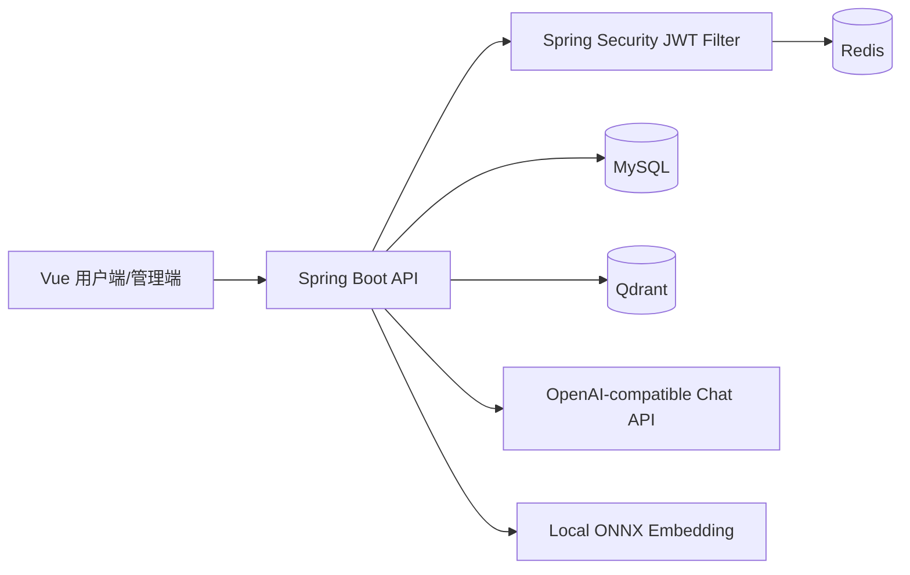
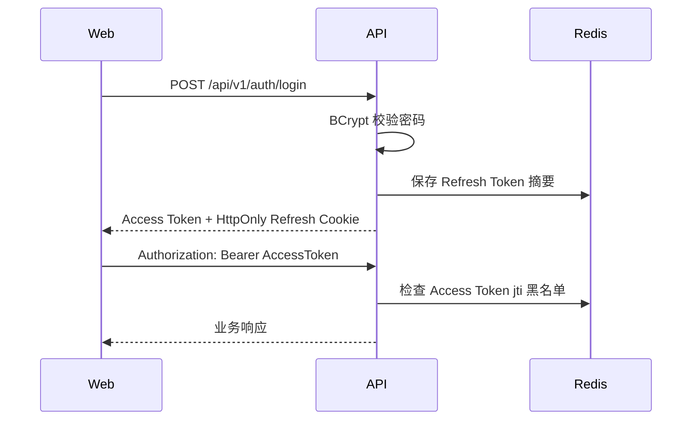
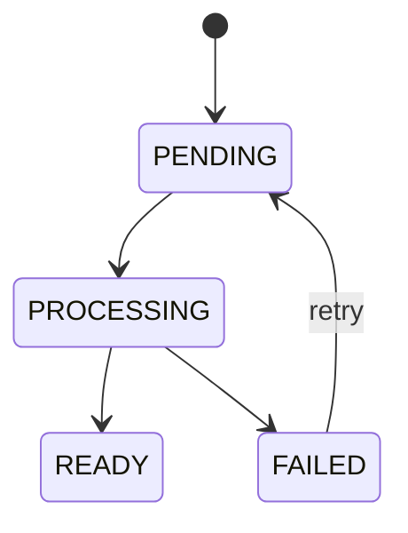
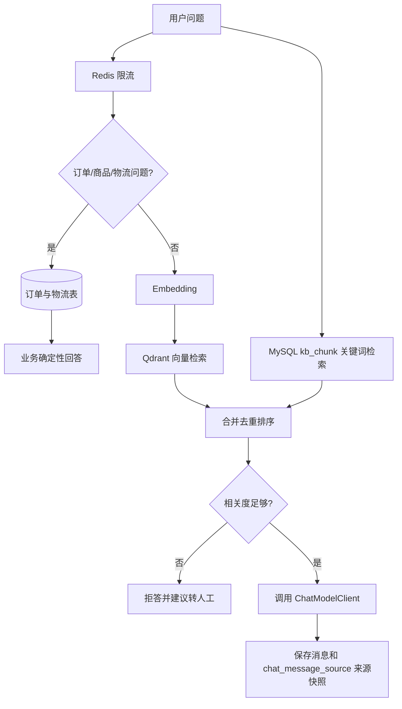
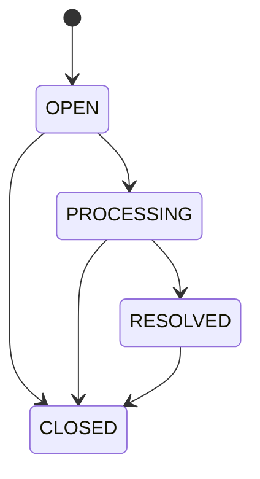

# 智服通

企业知识库客服与人工工单协同平台。项目定位是 Java 后端实习面试展示用的模块化单体应用，不是微服务系统。

## 项目背景

面向电商售后场景，用户可以咨询发货、物流、退款、退换货、商品售后和账号问题。系统对订单、物流、商品问题优先查询业务数据；未命中业务数据时，再从企业知识库检索资料，相关度足够时调用大模型生成客服回复；相关度不足时不调用大模型，并引导用户创建人工工单。

## 核心业务闭环

1. 管理员上传知识库文档。
2. 系统保存文档、创建处理任务，并异步解析、切片、生成向量、写入 Qdrant。
3. 用户登录后发起咨询。
4. 如果问题涉及订单、发货、物流或商品，系统优先查询业务订单和物流表并直接回答。
5. 未命中业务数据时，系统执行关键词检索 + 向量检索，构建 RAG Prompt。
6. 生成回答并保存引用来源快照。
7. 无法可靠回答时，用户创建工单。
8. 管理员处理工单，系统记录状态流转和操作日志。

## 技术栈

- 后端：Java 17、Spring Boot 3.3.5、Spring MVC、Spring Security、MyBatis-Plus、MySQL、Redis、Flyway、Qdrant、ONNX Runtime、WebClient
- 前端：Vue 3、TypeScript、Vite、Element Plus、Axios
- 文档解析：PDFBox、Apache POI、CommonMark
- 测试：JUnit 5、Mockito
- 部署：Docker Compose、Nginx

## 架构图



## JWT + Redis 认证流程



- Access Token 有效期默认 30 分钟。
- Refresh Token 放在 HttpOnly Cookie，服务端只在 Redis 保存摘要。
- 退出登录时删除 Refresh Token，并把当前 Access Token 的 jti 写入 Redis 黑名单。
- 前端路由守卫只负责体验，真正权限边界在后端。

## 文档处理状态机



文档上传接口返回 202，不等待完整解析结束。处理任务记录在 `document_processing_task`，失败后进入重试等待，超过重试次数后标记为失败。

## RAG 问答流程



## 工单状态机



非法状态流转会被拒绝。管理员处理工单时必须携带 `lockVersion`，并发修改冲突返回 409。

## 主要数据表

- `user_account`：用户账号、BCrypt 密码、角色和状态。
- `kb_document`：文档元数据、SHA-256、上传人、处理状态。
- `document_processing_task`：文档异步处理任务。
- `kb_chunk`：持久化知识片段。
- `product_catalog`：商品资料、库存、发货规则、售后规则。
- `customer_order`：用户订单、状态、预计发货时间、收货信息。
- `shipment_event`：订单物流轨迹。
- `chat_conversation`：用户会话。
- `chat_message`：聊天消息。
- `chat_message_source`：回答引用来源快照。
- `support_ticket`：人工工单。
- `ticket_operation_log`：工单操作日志。

## 本地启动

1. 复制 `.env.example` 为 `.env`。
2. 根据需要配置 MySQL、Redis、Qdrant 和模型路径。
3. 不提供 `LLM_API_KEY` 时，使用 Mock ChatModel。
4. 启动基础服务：

```powershell
docker compose -f deploy/docker-compose.yml up -d mysql redis qdrant
```

5. 启动后端：

```powershell
cd server
.\mvnw.cmd spring-boot:run
```

6. 启动前端：

```powershell
cd web
npm ci
npm run dev
```

## 环境变量

- `JWT_SECRET`：JWT 签名密钥，至少 32 字符。
- `ACCESS_TOKEN_TTL_MINUTES`：Access Token 有效期。
- `REFRESH_TOKEN_TTL_DAYS`：Refresh Token 有效期。
- `CHAT_RATE_LIMIT_PER_MINUTE`：单用户每分钟聊天次数限制。
- `DEMO_ADMIN_USERNAME` / `DEMO_ADMIN_PASSWORD`：本地演示管理员账号。
- `DEMO_CUSTOMER_USERNAME` / `DEMO_CUSTOMER_PASSWORD`：本地演示用户账号。
- `LLM_API_KEY`：真实大模型 API Key，只能写入本地 `.env`。

## 安全说明

真实 API Key 不得写入源码、README、测试文件、日志或提交历史。`.env` 已加入 `.gitignore`。当前前端为了降低项目复杂度仍把 Access Token 保存在 localStorage，存在 XSS 风险，README 不将其描述为最安全方案。

## 测试

```powershell
cd server
.\mvnw.cmd test

cd web
npm run build

docker compose -f deploy/docker-compose.yml config
```

## 当前功能边界

已实现：JWT + Redis 认证、Refresh Token Cookie、退出黑名单、商品/订单/物流业务查询、文档异步任务、kb_chunk 持久化、RAG 来源快照、聊天限流、工单状态机、乐观锁、操作日志、用户端和管理端页面。

已补充 Docker healthcheck、Actuator health/readiness、Maven Wrapper。未完成：完整 Testcontainers 覆盖、WireMock 外部服务测试、生产级密钥管理。
